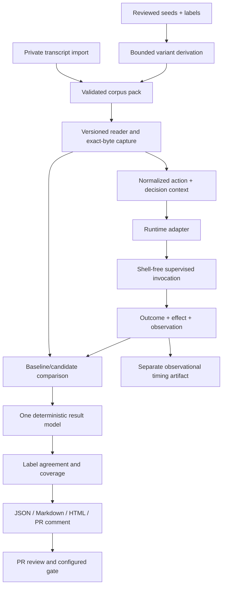

# Architecture

Status: proposed direction with incremental implementation. The current system
is mapped in [CODEBASE_MAP.md](CODEBASE_MAP.md); delivery order and completion
criteria live in [ROADMAP.md](ROADMAP.md). A heading in this document does not
mean the capability is implemented.

## Purpose and limits

A maintainer changing an agent guardrail needs a reviewable answer to four
questions: which decisions changed, which supplied labels disagree with those
decisions, which input shapes remain untested, and whether the hook is reliable
within a stated budget. A replay does not prove a command safe or reach every
possible command. The harness never executes corpus commands, resolves a URL,
contacts an MCP server, writes a corpus-described file, or applies a patch.

Runtime dependencies remain zero. Python 3.11+, Linux, macOS and Windows remain
first-class. The existing 0/1/2/3 exits and v1 readers remain available. New
semantics get explicit versioned identities rather than retroactive reinterpretation.

## Boundaries

The compare layer is pure. It does not inspect command grammar or runtime names.
The invocation layer owns subprocesses, timeout cleanup, environment and cwd.
The adapter owns payload construction and reply classification, not Popen or a
shell. Report renderers consume one result model and never run a hook.

## Runtime adapters

Start with a stdlib `Protocol` and an explicit built-in registry. Each adapter
has a name and versioned contract identity, builds a payload, declares its
invocation environment additions, and classifies a completed process reply.
The runner owns elapsed time, timeout and start-failed outcomes. Existing
`hooks.build_payload`, `hooks.classify`, and `hooks.event_cwd` remain compatibility
facades during extraction.

The initial Claude and Codex adapters preserve existing behaviour. That is a
compatibility milestone, not a new claim of current runtime fidelity. A later
versioned Codex contract must represent unsupported output as indeterminate,
not as evidence that a real runtime denied the action. Unknown adapters fail
before processes start. No plugin import string or arbitrary entry-point loader
is needed yet. See [ADR 0001](adr/0001-runtime-adapters.md).

## Actions and context

Keep strict `command-event.v1` reading unchanged. Introduce `action-event.v1` as a
separate discriminator-based format after adapters are stable. Its envelope has
an event ID, timestamp, source, action kind and typed payload. A shell action
contains the original command string and explicit shell/platform assumptions.
File write/edit actions carry a portable target and content digest; network
fetches carry redacted URLs; MCP actions carry a synthetic server/tool identity
and JSON arguments. Private content is not embedded merely to support replay.

A pure normalization step maps a command event into a shell action in memory.
It preserves ID, original bytes and legacy validation. A decision context binds
repo tier, permission mode, configuration digest, platform/shell assumptions and
workspace fixture digest. Missing context is explicit, never a guessed default
that makes a label appear applicable. Content-sensitive hooks need synthetic
content fixtures with digest binding; a digest alone cannot reconstruct content.
See [ADR 0002](adr/0002-action-events.md).

## Evidence, labels and scoring

Run two independent analyses over the same results: regression against the
baseline and agreement with supplied labels. Dangerous/allow and benign/deny
are label disagreements. Indeterminate has its own count and reduces decision
coverage; opaque and missing labels have no false-allow/false-deny denominator.
Use counts alongside rates, with null for an empty denominator.

v1 case metadata cannot prove independent labeling. Initial metrics therefore
say “agreement with supplied v1 labels”, not “safety accuracy”. Independent
scoring requires a new case-evidence schema: rubric ID/version, scoped expected
effect, label origin, individual assessments, unresolved disagreement and
adjudication. Preserve disagreements and abstentions. Do not treat repeated
variants from one seed as independent samples. An interval computed under a
binomial assumption is descriptive, not a safety bound for a convenience corpus.
See [ADR 0003](adr/0003-label-evidence.md).

## Variants and strength

Generate strings, never subprocesses. Every transform has a stable ID/version,
a declared shell/context domain, applicability predicate and documented label
transfer assumption. A deterministic order and event budget bound expansion.
A derived case records its seed, transform and source/output manifest digests.
The first pack uses reviewed, deliberately narrow POSIX transforms. Unsupported
syntax is recorded as an abstention instead of silently wrapping it.

Wrappers, prefixes and quoting have different domains. `env`, `sudo`, `timeout`,
pipelines and nested shells are not universally equivalent. Windows and
PowerShell need their own declared grammars and fixtures; the machine running
the generator must not choose the grammar. A separate mutation runner later
measures whether controlled toy-hook mutations are detected. Mutation score is
corpus sensitivity, not proof of production security. See
[ADR 0004](adr/0004-derived-variants.md).

## Reports and publication

The result model is the kernel's validated comparison plus explicit hook-source
failure evidence. Derive summary counts, label metrics, static HTML and compact
PR text from it. Renderers escape every event ID, family, command and reason.
HTML is standalone, has no external assets or network requests, offers filters,
and remains readable with JavaScript disabled. PR comments default to aggregate
counts and synthetic case identifiers, with commands/reasons omitted.

Keep decision artifacts deterministic. Wall-clock latency belongs in a clearly
marked `measurements.json` sidecar and never enters run identity, stable HTML or
committable summaries. A fixed `SOURCE_DATE_EPOCH` remains necessary for the
legacy report timestamp until a versioned deterministic publication contract
replaces that default. Record p50/p95/max, sample count, timeout count and jobs;
measurements across different concurrency settings are not interchangeable.

A GitHub Action is a thin caller of the CLI. Run untrusted candidate hooks only
in an unprivileged `pull_request` job with read-only permissions, no secrets and
no persisted checkout credentials. Do not use `pull_request_target` to execute
candidate code. Posting a comment requires a distinct, explicitly authorized
boundary; it must validate artifact identity and avoid executing artifacts.
No automatic artifact upload of a private corpus or full report occurs by
default. See [ADR 0005](adr/0005-report-pipeline.md).

Read-only workflow permissions limit the GitHub token, not the hook. The hook
runner is unsandboxed: a candidate hook can read and write the job's
filesystem, reach the network and rewrite the corpus, recordings or reports it
shares a job with. Therefore a report produced in the same job as an untrusted
hook is evidence of that job's claims only, never a trusted artifact, and it
must not be evaluated against a private corpus. Trusting results from a fork or
unreviewed hook requires an OS-level filesystem and network isolation boundary
around the hook, with corpus capture, verification and report generation
outside the hook's authority. Until that boundary exists, the Action runs only
public synthetic corpora for untrusted candidates.

## Kernel evolution and trust

Keep the trusted core small by separating responsibilities, not by weakening
checks. The exact-byte manifest parser, unique JSON-key rejection, event joins,
source identities, snapshot verification, transactional publication and process
tree cleanup remain. Work toward reusable modules for supervised invocation,
recorded sources and immutable snapshots, while preserving public imports until
a migration is available. See [ADR 0006](adr/0006-kernel-simplification.md).

Convenience hook identity is currently weaker than kernel process identity.
A follow-up must capture code/config/context before execution, bind it in a
versioned hook-source manifest, and verify it after execution. Moving all hooks
into the process-source API without modeling their invocation contract would
change semantics and is rejected.

## Validation and release gates

Every increment adds tests at the boundary it changes, runs the full unittest
lane, Ruff and Black, and uses exact-head CI for all three operating systems.
Keep the existing toy regression counts stable. Add adversarial text escaping,
empty denominators, malformed/duplicate records, both-side failures, timeout and
workspace isolation, byte-identical renderings, deterministic derivation and
never-execute sentinels. A green Linux run does not stand in for Windows Job
Object validation.

No released version changes here merely because a planned milestone exists.
Draft PRs become review-ready only after their own current head is verified.
