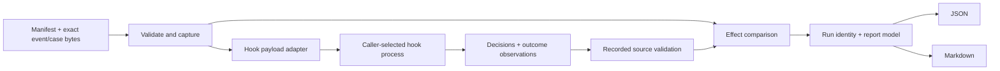

# Codebase map and first findings

Inspected baseline: `4a208a5dafc05f8282a4d3ff393aa1af70d2769e` (v0.1.0).
The supplied archive reconstructs the exact Git tree
`00f5903b730f262c3db48ddbf66ace491597e058`. No open issues or PRs preceded this work.
The baseline local test lane runs 188 tests in 66.493 seconds, with one
Windows-only test skipped on Linux. This is not evidence of a Windows run.

## Modules and data flow

| Boundary | Modules | Responsibility |
|---|---|---|
| User entry | `app.py` | Dispatch `hooks`, `record`, `import`; delegate `replay` and `validate` to the kernel; render hook summaries. |
| Runtime bridge | `hooks.py` | Parse shell-free hook argv; construct PreToolUse payloads; classify replies; map outcomes to effects; create workspaces; record decisions and observations. |
| Trusted input | `corpus.py`, `manifests.py`, `digests.py` | Validate strict v1 shapes and unique IDs; capture exact corpus bytes; bind files, identities and gate settings. |
| Comparison orchestration | `cli.py` | Load sources and corpus, construct a run manifest, evaluate sources, compare and transactionally publish the kernel report set. |
| Policy execution | `policy_sources.py` | Validate recordings; snapshot process inputs; verify identities before and after execution; supervise POSIX process groups and Windows Job Objects. |
| Semantics | `compare.py` | Join by event ID in corpus order and classify effect transitions without interpreting command text. |
| Presentation | `reports.py`, `app.py` | Kernel JSON/Markdown and hook summary JSON/Markdown. |
| Private collection | `importer.py` | Extract shell events from local transcripts, scrub identifying data, and refuse Git-trackable destinations. |

Only the caller-selected hook or policy program runs. Corpus commands remain
strings on stdin. This is not a sandbox for an untrusted hook.

## Contracts to preserve

`command-event.v1`, `policy-decision.v1` and `charter-case.v1` reject unexpected
fields. The two-file corpus manifest binds `events.jsonl` and `cases.jsonl` by
SHA-256. Recorded decisions have an exact-byte sidecar. The process source has
stronger snapshot binding than the convenience hook recorder. These are not
interchangeable guarantees.

Effects are `allow`, `deny`, `indeterminate`. Actual kernel diff names are
`unchanged`, `newly-allowed`, `newly-denied`, `newly-indeterminate`, and
`resolved-indeterminate`. The brief's phrase “newly blocked” is descriptive,
not a new wire value. Exit 0 means gate pass; 1 means configured regression;
2 means invalid or unbound inputs; 3 means source/output failure when a
comparison can be formed. Failure has precedence over the regression exit.

Run identity binds runner version, policy identities, corpus manifest and gate.
`generated_at` is excluded from that identity, but enters report bytes. The
current kernel needs a fixed `SOURCE_DATE_EPOCH` for byte-identical reports.
Kernel Markdown deliberately includes host-local reproduction paths. Timing
in `outcomes.jsonl` is observational and not deterministic.

## Ranked blockers and fragile boundaries

1. **Failure evidence can disappear at the convenience boundary.** `hooks`
   records crashes/timeouts as indeterminate decisions, then asks the kernel to
   compare recordings. Two crashing hooks can therefore have an unchanged diff
   and a passing gate. Add failure propagation and exit-code regressions first.
2. **Runtime fidelity is not yet certified.** Both payload builders are the
   same; Codex differs only for ask. Current official Codex documentation says
   unsupported ask/legacy approve/continue fields fail the hook and continue
   the call. Preserve extraction behaviour, then introduce a versioned,
   explicit contract rather than silently presenting the old floor as runtime
   truth. See [runtime notes](RUNTIME_CONTRACTS.md).
3. **Hook input/context identity is weaker than process identity.** Hook
   argv/file identity is calculated after execution, omits executable bytes at
   argv[0], and does not bind runtime, workspace context or inherited config.
   Do not simplify the kernel by deleting protections the recorder needs.
4. **Workspace and admission can affect results.** A side shares one writable
   workspace across concurrent cases. Its process cwd is the workspace root,
   even when the payload names a nested cwd. Several CLI inputs are validated
   only after another side has already executed.
5. **Labels and variants can create false confidence.** v1 provenance describes
   event origin, not independent adjudication. Copying a label across arbitrary
   shell wrappers does not establish equivalent semantics. Report observations
   honestly and expose applicability/abstentions and seed lineage.
6. **Presentation is split and privacy is easy to overstate.** Summary Markdown
   interpolates free-text family names without the kernel's escaping. Full
   reports carry commands and reasons. A private corpus needs a separate
   aggregate-only export, not a claim that HTML escaping anonymizes content.
7. **The large process module mixes real boundaries.** About 1,250 lines combine
   process supervision, Windows support, snapshots, recordings and validation.
   Extract pure runtime adapters and rendering first; split supervision and
   snapshot internals only behind their existing contract tests.

## Assumptions

The brief authorizes autonomous, separately reviewable increments. Release
names, licence and zero runtime dependencies stay unchanged. No package release,
external account registration or claim of independently certified safety occurs
in this work. Proposed architecture is distinguished from implemented behaviour
in the roadmap and individual PR evidence.
